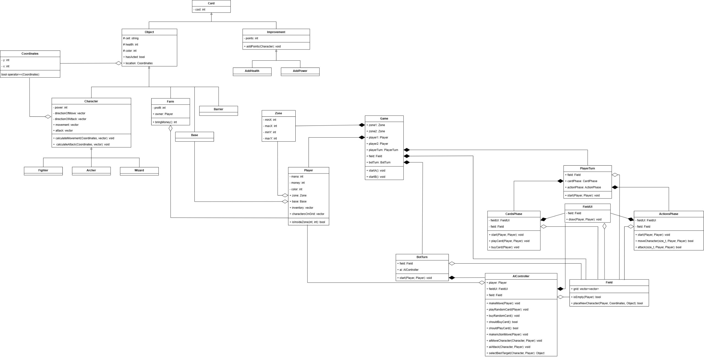

# Class Descriptions

# 1. Classes  
## Hierarchy of game objects (…→ Card)  
Base class:  
- Card (entity for all game objects)  
Subclasses:  
  - Character → Card  
  - Improvement → Card (Improvement class)  
    - AddHealth → Improvement  
    - AddPower → Improvement  
  - Object → Card (Class for all units)  
    - Farm → Object  
    - Barrier → Object  
    - Base → Object  
  - Character → Object (Class for all characters)  
    - Fighter → Character  
    - Archer → Character  
    - Wizard → Character  

---

## Game Phases  
- CardPhase, ActionPhase, PlayerTurn, BotTurn  
  - Implement a shared interface for managing game phases.  

---

## Specialized Classes  
- `AIController`  
  - Handles AI control logic.  

---

## Utility Classes  
- `Coordinates`, `Zone`, `Card`, `FieldUI`  
  - Not inherited by other classes; serve as auxiliary components.  

---

# 2. Composition  
`Game` and its composition components (created and managed by the game; deleting the game deletes these objects):  
- Game → Zone (zone1, zone2)  
- Game → Player (player1, player2)  
- Game → Field  
- Game → PlayerTurn, BotTurn  

`BotTurn` and its composition components (created and managed by BotTurn; deleting BotTurn deletes these objects):  
- BotTurn → AIController  

`PlayerTurn` and its composition components (created and managed by PlayerTurn; deleting PlayerTurn deletes these objects):  
- PlayerTurn → CardsPhase  
- PlayerTurn → ActionsPhase  

`FieldUI` as a composition component (created and managed by the owning class; deletion of the owner deletes `FieldUI`):  
- CardsPhase → FieldUI  
- ActionsPhase → FieldUI  
- AIController → FieldUI  

---

# 3. Design Principles  
1. Encapsulation  
   Each class handles its own logic (e.g., AIController does not affect rendering, and FieldUI does not modify unit states).  
2. Flexibility via Inheritance  
   Adding new unit types (`Character`) or improvements (`Improvement`) does not require changes to core logic.  
3. Phase Separation  
   Using CardPhase and ActionPhase simplifies game flow management (State pattern).  
4. Dependency Control  
   Composition and aggregation clearly define object ownership (e.g., Player owns Base but treats Card as an external resource).  

