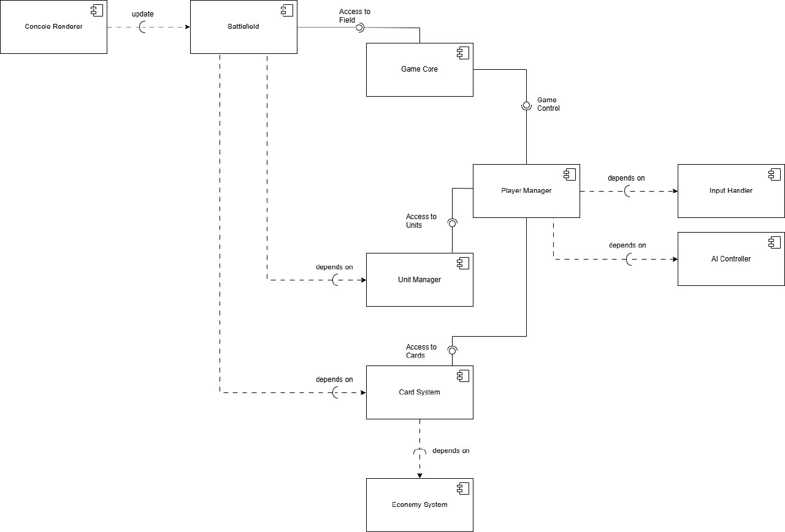

# Component Descriptions

## Game Core
 • Manages the game loop, turn transitions, and victory condition checks.
 • Coordinates interactions between other components.
## Battlefield
 • Stores the state of the grid (10x10) and units.
 • Handles collisions and movement.
## Player Manager
 • Manages player resources (mana, coins).
 • Processes command input (via Input Handler).
## Card System
 • Manages decks and card distribution.
 • Implements card activation logic (units/upgrades).
## Console Renderer
 • Displays the battlefield, units, and interface in the terminal.
 • Uses symbols for visualization.
## Economy System
 • Handles card purchases (3 coins = 1 card).
## Input Handler
 • Reads keyboard input.
 • Converts raw input into game commands.
## Unit Manager
 • Manages unit states (health, attack).
 • Implements actions: attack, movement.
## AIController
 • Handles AI bot logic: emulates player actions (card selection, unit control).
