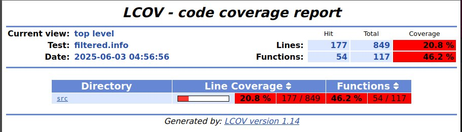

Manaclash Testing Report  

---  
### 1. Summary  
- Tests Passed: 33/33 (100% success rate).  
- Automation Functions Coverage: 46,2% (25/33 tests automated, including unit and integration tests).  

- Critical Issues: None identified.  
- Stability: No crashes, failures, or memory leaks observed during extended runs and edge case testing.  

---  
### 2. Detailed Breakdown  

#### 2.1. Core Gameplay  
- Result: All features function correctly.  
- Key Notes:  
  - Starting conditions meet the requirements.  
  - Victory conditions are handled properly, with the results screen displayed.  

#### 2.2. Card and Resource System  
- Result: Verified and confirmed.  
- Key Notes:  
  - Mana consumption on card deployment matches the specified values.  
  - Purchasing additional cards correctly adds cards to the hand.  

#### 2.3. Combat Interactions  
- Result: Combat logic aligns with specifications.  
- Key Notes:  
  - Damage calculation (attack - defense) works correctly.  
  - Blocking of repeated character actions within the same turn is implemented.  

#### 2.4. Buildings and Upgrades  
- Result: Core functions operate stably.  
- Key Notes:  
  - Buildings are placed without errors.  
  - Upgrades correctly increase character stats.  
  - Placement restrictions for buildings on occupied cells work properly.  

#### 2.5. Interface and Navigation  
- Result: Resource display and UI elements function without issues.  
- Key Notes:  
  - Mana and coin values update in real time.  

#### 2.6. Edge Cases  
- Result: The system is robust under load and unusual scenarios.  
- Key Notes:  
  - Maximum number of units on the field does not cause failures.  
  - New card placement is blocked when the field is full.  

---  
### 3. Conclusion  
The game meets all core requirements with no critical defects. It is recommended to continue testing with external testers to evaluate game balance and user experience.
